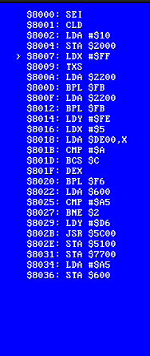

# fancy-nes

## CI & Artifacts

### Platform Support

| Platform       | Notes | Workflow Badge |
| -------------- | ----: | -------------: |
| Windows (x64)  | Fully supported - built on Windows Server 2022 |  |
| macOS (x64)    | Fully supported - built on macOS 11.6          |  | 
| Linux (x64)    | Not supported in CI - see below                |  |

### Note about Linux support

Linux builds _are_ definitely possible, so if you want to build for Linux on your own machine, go right ahead.
The CI currently cannot build for Linux, as the `pkg-config-rs` create, coupled with `rust-sdl2`'s flaky support for static linkage means that builds fail at the link stage. Hopefully this will be resolved soon.

Click on the above badge to find recent builds for your platform.

## License
Copyright 2022 Benjamin Mordaunt <benmordaunt@protonmail.com>

Licensed under the Apache License, Version 2.0 (the "License");
you may not use this file except in compliance with the License.
You may obtain a copy of the License at

    http://www.apache.org/licenses/LICENSE-2.0

Unless required by applicable law or agreed to in writing, software
distributed under the License is distributed on an "AS IS" BASIS,
WITHOUT WARRANTIES OR CONDITIONS OF ANY KIND, either express or implied.
See the License for the specific language governing permissions and
limitations under the License.

### Disassembly Demo

The emulator currently has (mostly working) 6502 emulation and work is
ongoing to implement the PPU to produce graphics.

Below is an example of the disassembly of the first 26 instructions run
in the emulated CPU after the reset vector for Super Mario Bros. (E).

